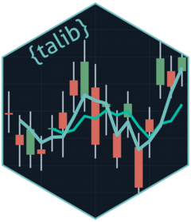
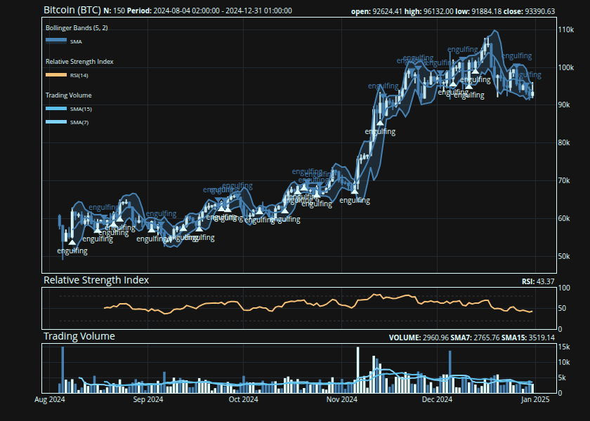
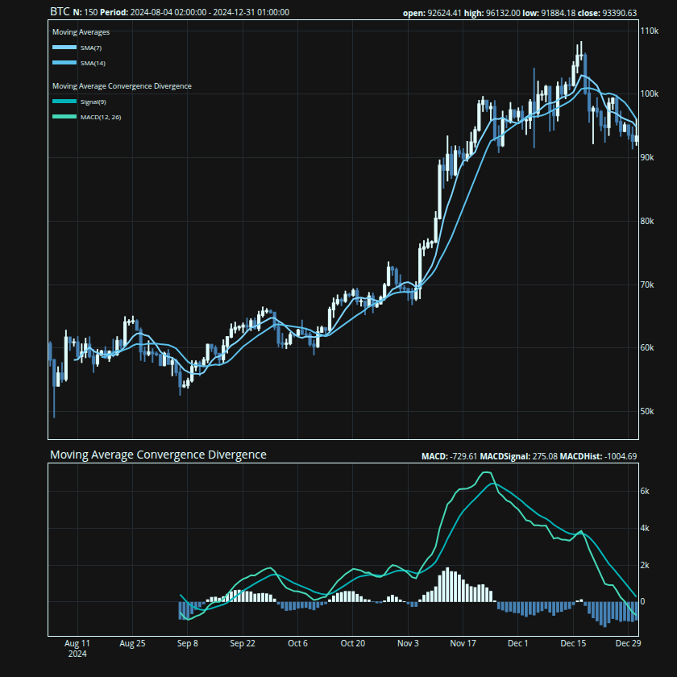
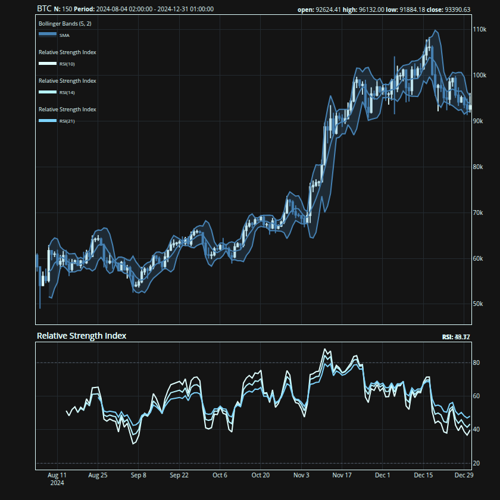
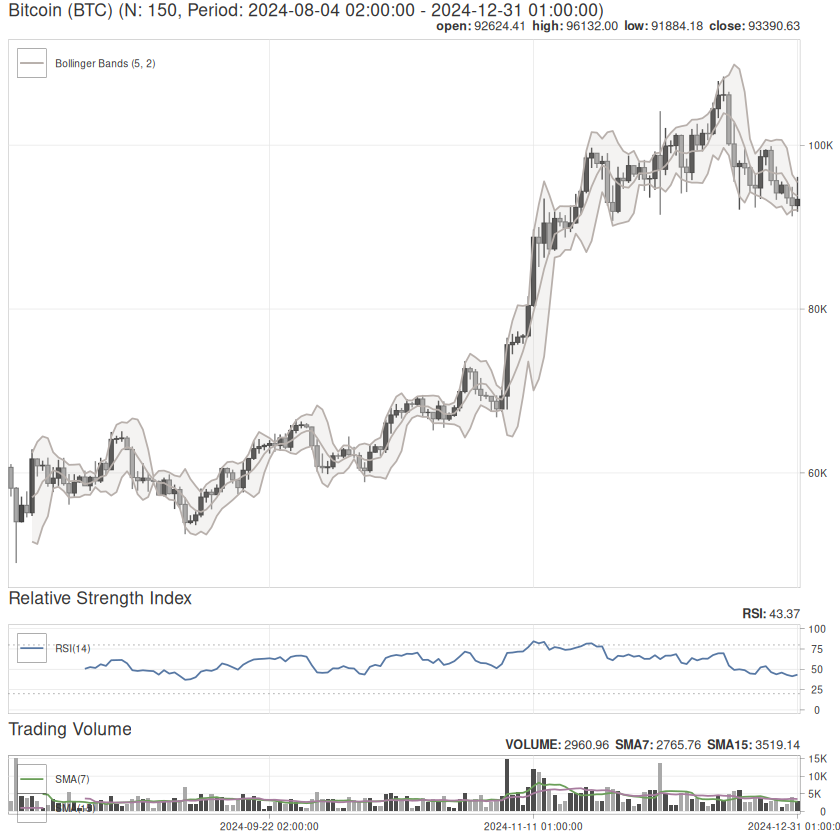

<!-- README.md is generated from dev/README.Rmd. Please edit that file -->

# {talib}: A Technical Analysis and Candlestick Pattern Library in R 

<!-- badges: start -->

[](https://github.com/serkor1/ta-lib-R/actions/workflows/R-CMD-check.yaml)
[](https://github.com/serkor1/ta-lib-R/actions/workflows/remote-install.yaml)
[](https://app.codecov.io/gh/serkor1/ta-lib-R)
[](https://CRAN.R-project.org/package=talib)
[](https://r-pkg.org/pkg/talib)
<!-- badges: end -->

[{talib}](https://serkor1.github.io/ta-lib-R/) is an R package for
technical analysis, candlestick pattern recognition, and interactive
financial charting—built on the
[TA-Lib](https://github.com/TA-Lib/ta-lib) C library. It provides 67
technical indicators, 61 candlestick patterns, and a composable charting
system powered by [{plotly}](https://github.com/plotly/plotly.R) and
[{ggplot2}](https://ggplot2.tidyverse.org/). All indicator computations
are implemented in C via `.Call()` for minimal overhead.

Alongside [{TTR}](https://github.com/joshuaulrich/TTR),
[{talib}](https://serkor1.github.io/ta-lib-R/) adds candlestick pattern
recognition and interactive charts to the R technical analysis
ecosystem.

``` r
{
    ## create a candlestick chart
    talib::chart(BTC, title = "Bitcoin (BTC)")

    ## overlay Bollinger Bands on
    ## the price panel
    talib::indicator(talib::bollinger_bands)

    ## mark Engulfing candlestick
    ## patterns on the chart
    talib::indicator(talib::engulfing, data = BTC)

    ## add RSI and volume as
    ## separate sub-panels
    talib::indicator(talib::RSI)
    talib::indicator(talib::trading_volume)
}
```



## Indicators

Every indicator follows the same interface: pass an OHLCV `data.frame`
or `matrix` and get the same type back. The return type always matches
the input.

``` r
## compute Bollinger Bands
## on BTC OHLCV data
tail(
    talib::bollinger_bands(BTC)
)
#>                     UpperBand MiddleBand LowerBand
#> 2024-12-26 01:00:00 100487.38   96698.61  92909.83
#> 2024-12-27 01:00:00 100670.65   96512.96  92355.27
#> 2024-12-28 01:00:00 100632.13   96581.91  92531.69
#> 2024-12-29 01:00:00  99628.77   95576.60  91524.43
#> 2024-12-30 01:00:00  96403.53   94231.31  92059.09
#> 2024-12-31 01:00:00  95441.13   93774.23  92107.34
```

## Candlestick Patterns

{talib} recognizes 61 candlestick patterns—from single-candle formations
like Doji and Hammer to multi-candle patterns like Morning Star and
Three White Soldiers. Each pattern returns a normalized score: `1`
(bullish), `-1` (bearish), or `0` (no pattern).

``` r
## detect Engulfing patterns:
## 1 = bullish, -1 = bearish, 0 = none
tail(
    talib::engulfing(BTC)
)
#>                     CDLENGULFING
#> 2024-12-26 01:00:00           -1
#> 2024-12-27 01:00:00            0
#> 2024-12-28 01:00:00            0
#> 2024-12-29 01:00:00           -1
#> 2024-12-30 01:00:00            0
#> 2024-12-31 01:00:00            0
```

## Charts

Charts are built in two steps: `chart()` creates the price chart, then
`indicator()` layers on technical indicators. Overlap indicators (moving
averages, Bollinger Bands) draw on the price panel; oscillators (RSI,
MACD) get their own sub-panels.

``` r
{
    ## price chart with two moving
    ## averages and MACD below
    talib::chart(BTC)
    talib::indicator(talib::SMA, n = 7)
    talib::indicator(talib::SMA, n = 14)
    talib::indicator(talib::MACD)
}
```



Multiple indicators can share a sub-panel by passing them as calls:

``` r
{
    talib::chart(BTC)
    talib::indicator(talib::BBANDS)

    ## pass multiple calls to combine
    ## them on a single sub-panel
    talib::indicator(
        talib::RSI(n = 10),
        talib::RSI(n = 14),
        talib::RSI(n = 21)
    )
}
```



The charting system ships with 5 built-in themes inspired by
[chartthemes.com](https://chartthemes.com/): `default`,
`hawks_and_doves`, `payout`, `tp_slapped`, and `trust_the_process`.
Switch themes with `set_theme()`. Both
[{plotly}](https://github.com/plotly/plotly.R) (interactive, default)
and [{ggplot2}](https://ggplot2.tidyverse.org/) (static) backends are
supported:

``` r
{
    ## switch to ggplot2 backend with
    ## the "Hawks and Doves" theme
    talib::set_theme("hawks_and_doves")
    talib::chart(BTC, title = "Bitcoin (BTC)")
    talib::indicator(talib::BBANDS)
    talib::indicator(talib::RSI)
    talib::indicator(talib::trading_volume)
}
```



## Column selection

Indicators use the columns they need automatically. When your data has
non-standard column names, remap them with formula syntax:

``` r
## remap 'price' to the close column
talib::RSI(x, cols = ~price)

## remap hi, lo, last to high, low, close
talib::stochastic(x, cols = ~ hi + lo + last)
```

## Naming

Functions use descriptive snake_case names, but every function is
aliased to its TA-Lib shorthand for compatibility with the broader
ecosystem:

<div align="center">

| Category              | TA-Lib (C)           | {talib}                     |
|:----------------------|:---------------------|:----------------------------|
| Overlap Studies       | `TA_BBANDS()`        | `bollinger_bands()`         |
| Momentum Indicators   | `TA_CCI()`           | `commodity_channel_index()` |
| Volume Indicators     | `TA_OBV()`           | `on_balance_volume()`       |
| Volatility Indicators | `TA_ATR()`           | `average_true_range()`      |
| Price Transform       | `TA_AVGPRICE()`      | `average_price()`           |
| Cycle Indicators      | `TA_HT_SINE()`       | `sine_wave()`               |
| Pattern Recognition   | `TA_CDLHANGINGMAN()` | `hanging_man()`             |

</div>

``` r
## snake_case and TA-Lib aliases
## are identical
all.equal(
    target = talib::bollinger_bands(BTC),
    current = talib::BBANDS(BTC)
)
#> [1] TRUE
```

## Installation[^1]

``` r
pak::pak("serkor1/ta-lib-R")
```

Or from source:

``` shell
git clone --recursive https://github.com/serkor1/ta-lib-R.git
cd ta-lib-R
make build
```

## Code of Conduct

Please note that [{talib}](https://serkor1.github.io/ta-lib-R/) is
released with a [Contributor Code of
Conduct](https://contributor-covenant.org/version/2/1/CODE_OF_CONDUCT.html).
By contributing to this project, you agree to abide by its terms.

[^1]: [TA-Lib](https://github.com/TA-Lib/ta-lib) is vendored via
    `CMake`, so a pre-installed TA-Lib is not required. Some systems
    (Windows in particular) may require `CMake` to be explicitly
    installed.
